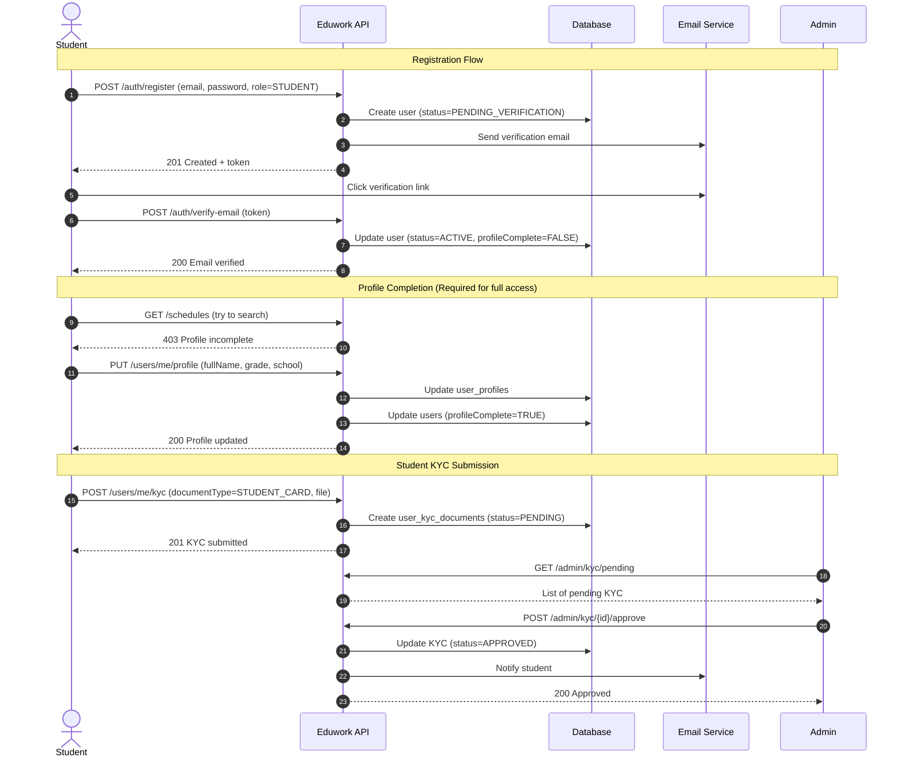
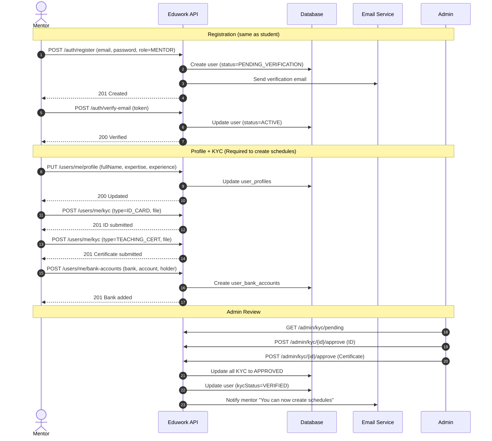
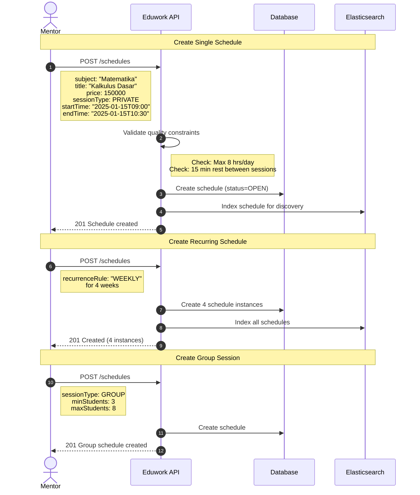
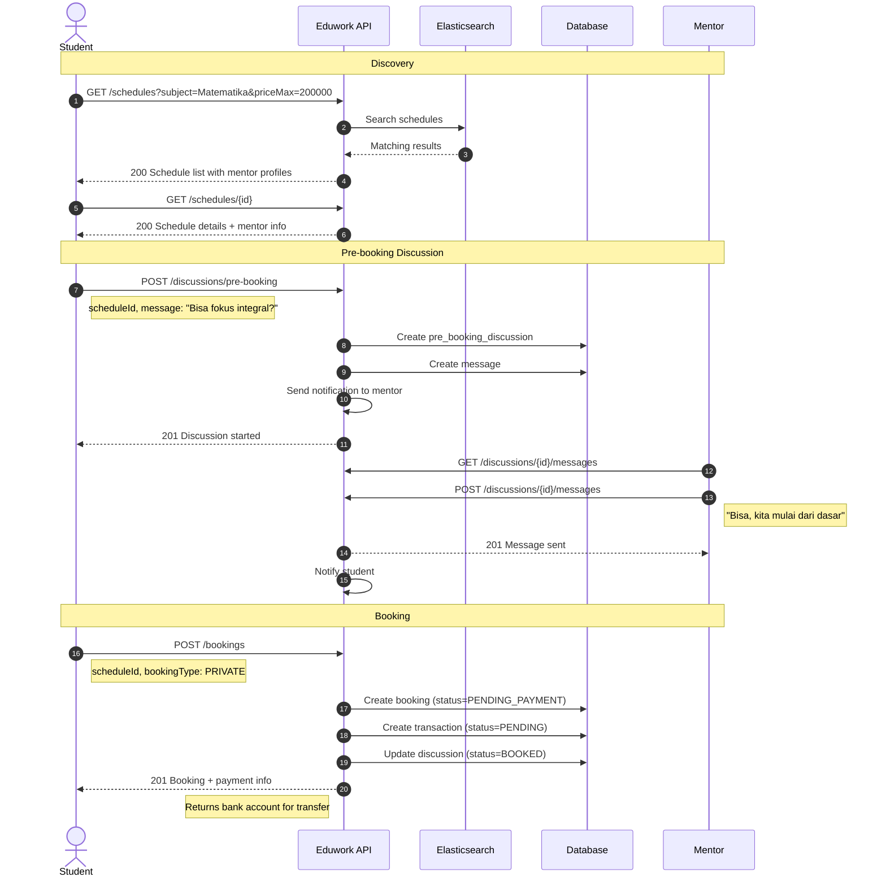
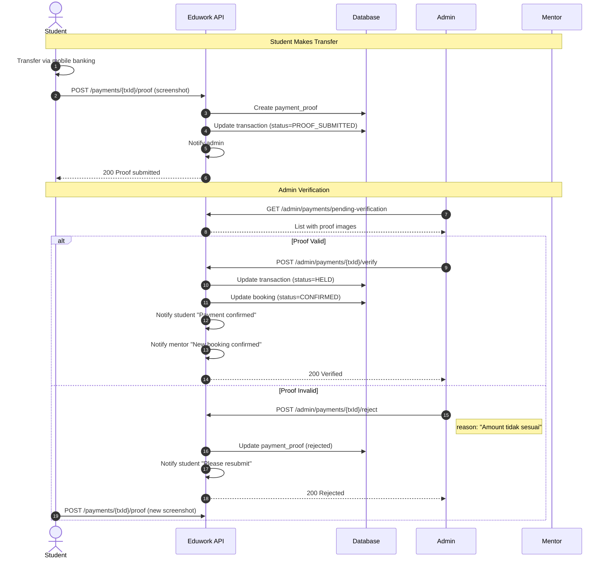
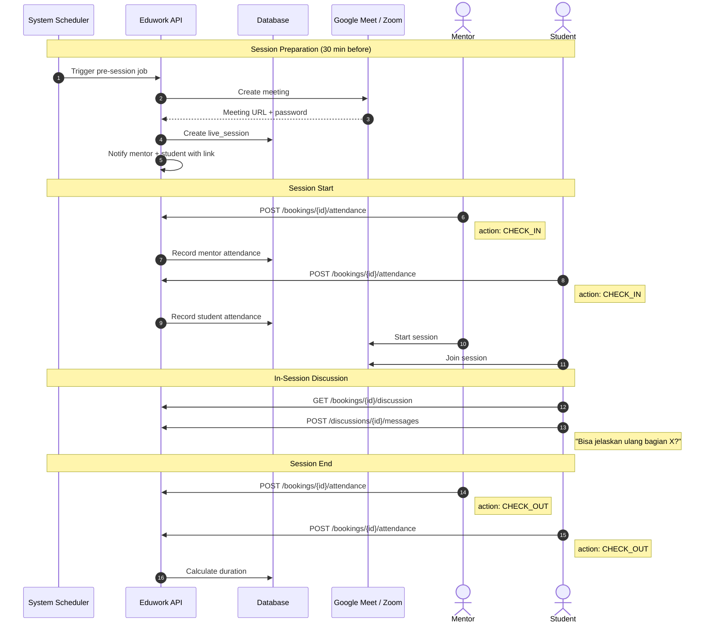
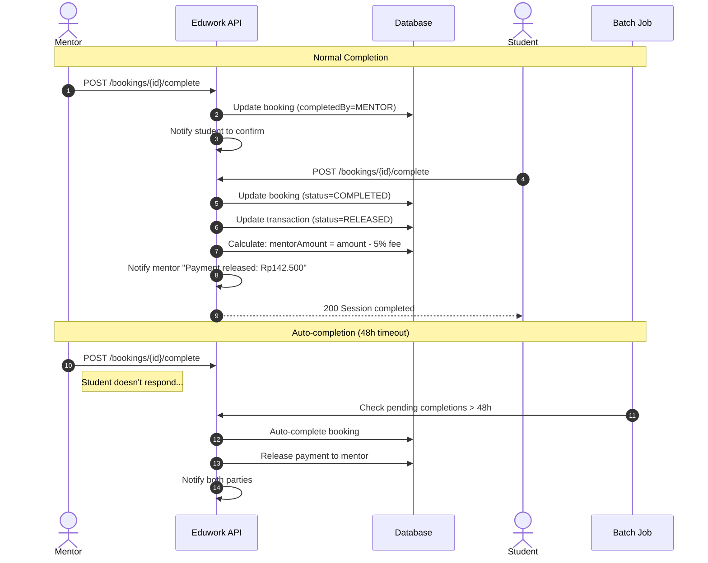
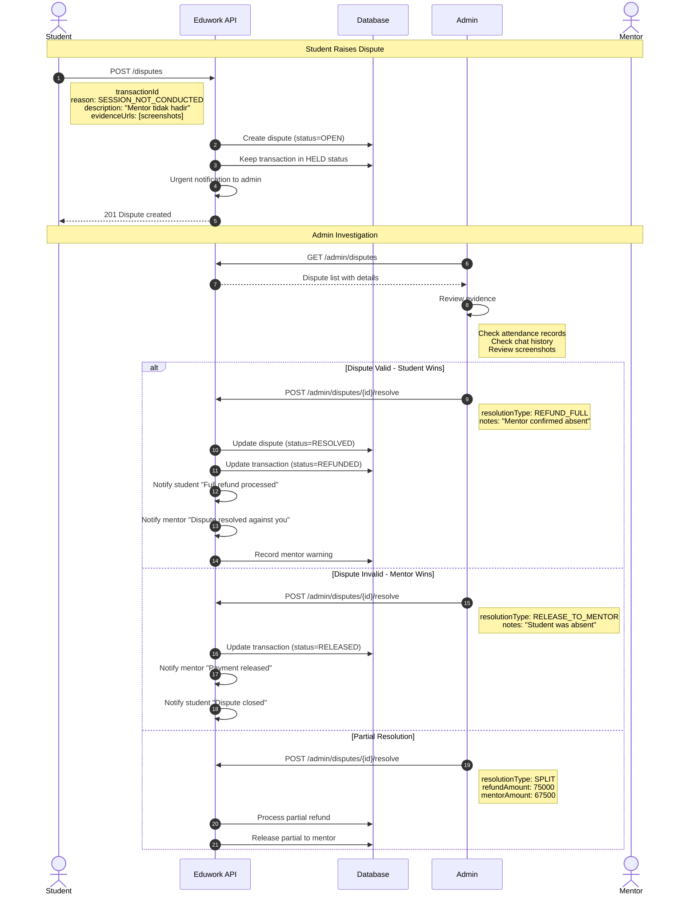
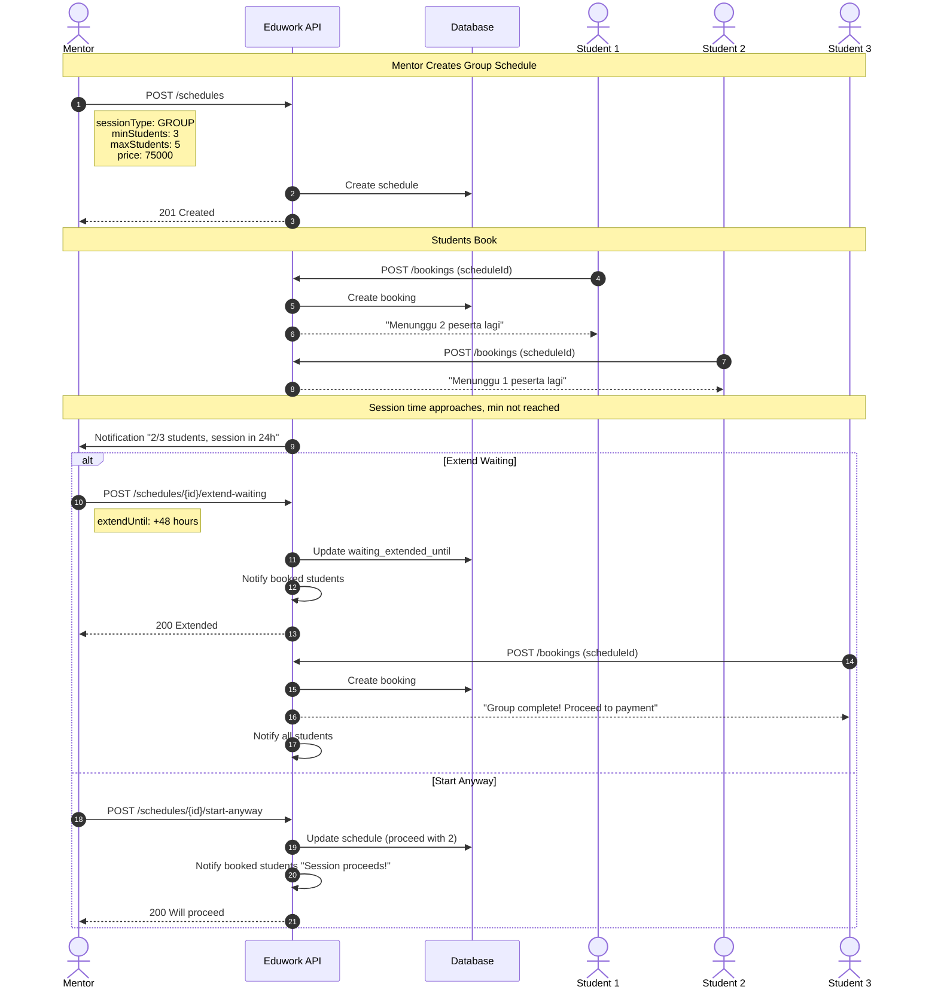
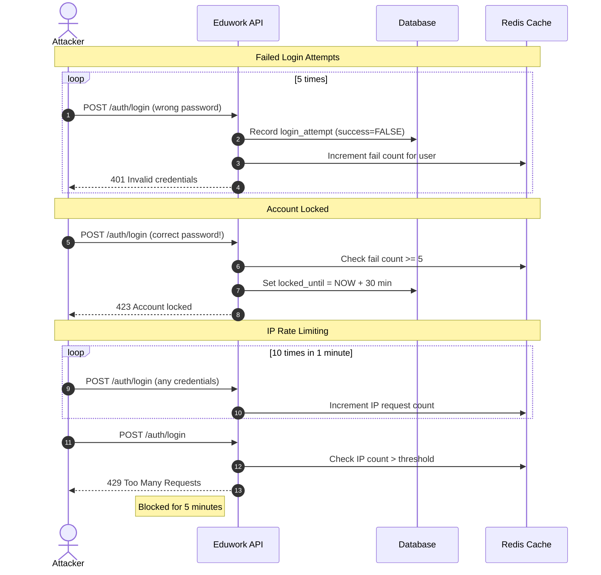

# Eduwork E2E Flow - Sequence Diagrams

Complete user journey diagrams for all platform scenarios.

---

## Journey 1: Student Registration & Onboarding

---

## Journey 2: Mentor Registration & KYC

---

## Journey 3: Mentor Creates Schedule

---

## Journey 4: Student Discovers & Books Schedule

---

## Journey 5: Payment Flow (Manual Transfer)

---

## Journey 6: Live Session Execution

---

## Journey 7: Session Completion & Settlement

---

## Journey 8: Dispute Resolution

---

## Journey 9: Group Session Flow

---

## Journey 10: Brute Force Protection

---

## System Events Summary

| Event | Trigger | Actions |
|-------|---------|---------|
| Pre-session reminder | 30 min before | Create Meet/Zoom link, notify users |
| Session start check | At start time | Check attendance, send reminders |
| Auto-completion | 48h after mentor marks complete | Release payment if no student response |
| KYC reminder | 24h after registration | Email users with incomplete KYC |
| Group min warning | 24h before session | Notify mentor about group status |
| Dispute escalation | 72h no admin action | Alert senior admin |
| Payment settlement batch | Daily at midnight | Process all released transactions |
