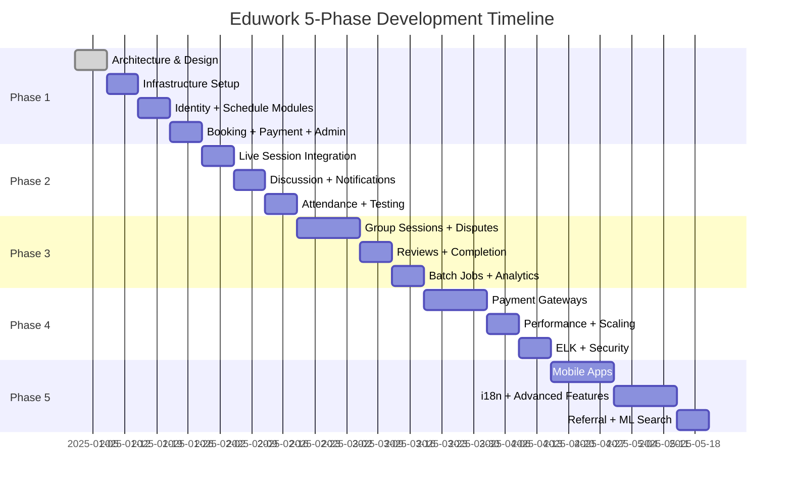
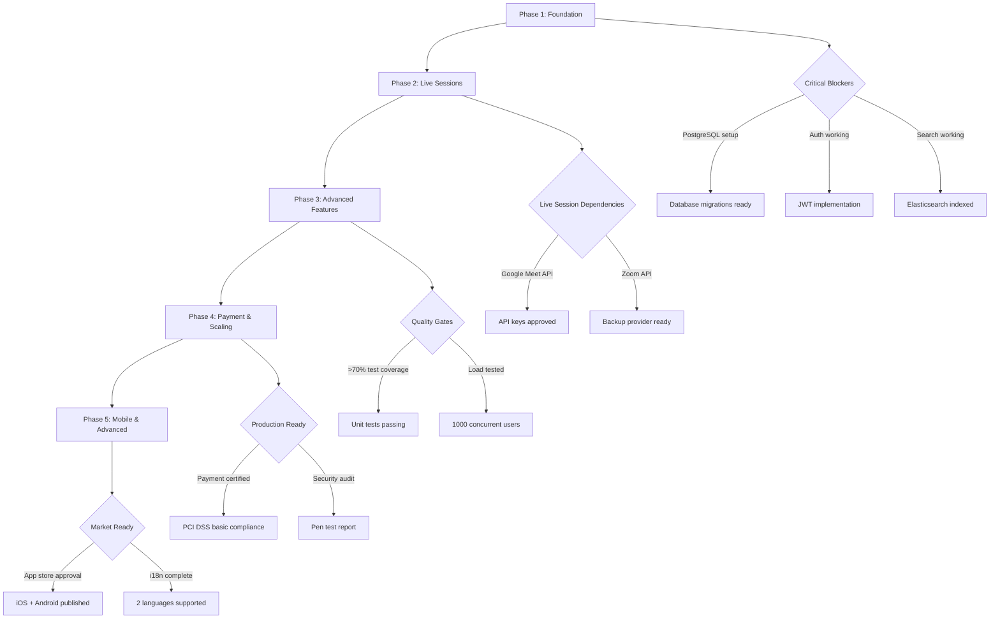

# Eduwork Development Roadmap - Visual Timeline

## Timeline Overview

---

## Resource Requirements by Phase

### Phase 1: Foundation & MVP (4 weeks)
**Team Size**: 3-4 developers + 1 DevOps

| Role | Allocation | Focus |
|------|------------|-------|
| Backend Developer 1 | 100% | Identity + Auth module |
| Backend Developer 2 | 100% | Schedule + Booking modules |
| Backend Developer 3 | 100% | Payment + Admin modules |
| DevOps Engineer | 50% | Infrastructure, CI/CD |
| UI/UX Designer | 50% | Admin dashboard design |
| QA Engineer | 25% | Test planning |

**Infrastructure Costs**: ~$200/month (staging + dev)

---

### Phase 2: Live Sessions & Communication (3 weeks)
**Team Size**: 3 developers + 1 DevOps

| Role | Allocation | Focus |
|------|------------|-------|
| Backend Developer 1 | 100% | Google Meet/Zoom integration |
| Backend Developer 2 | 100% | Discussion + messaging system |
| Backend Developer 3 | 100% | Notifications + attendance |
| DevOps Engineer | 25% | Monitoring setup |
| QA Engineer | 50% | Integration testing |

**Infrastructure Costs**: ~$250/month (+ video API costs)
**External Services**: Google Meet API, Zoom API

---

### Phase 3: Advanced Features (4 weeks)
**Team Size**: 4 developers

| Role | Allocation | Focus |
|------|------------|-------|
| Backend Developer 1 | 100% | Group sessions logic |
| Backend Developer 2 | 100% | Dispute resolution system |
| Backend Developer 3 | 100% | Review & rating system |
| Backend Developer 4 | 100% | Batch jobs + analytics |
| QA Engineer | 75% | End-to-end testing |
| Product Manager | 50% | Feature validation |

**Infrastructure Costs**: ~$300/month

---

### Phase 4: Payment Gateway & Scaling (4 weeks)
**Team Size**: 3 developers + 1 DevOps + 1 Security

| Role | Allocation | Focus |
|------|------------|-------|
| Backend Developer 1 | 100% | Payment gateway integration |
| Backend Developer 2 | 100% | Performance optimization |
| DevOps Engineer | 100% | Kubernetes, scaling |
| Security Engineer | 100% | Security audit, pen testing |
| Database Admin | 50% | Query optimization, replicas |

**Infrastructure Costs**: ~$800/month (production-ready)
**External Services**: Midtrans/Xendit payment gateways

---

### Phase 5: Mobile & Advanced (5 weeks)
**Team Size**: 5-6 developers

| Role | Allocation | Focus |
|------|------------|-------|
| Mobile Developer 1 | 100% | Student mobile app |
| Mobile Developer 2 | 100% | Mentor mobile app |
| Backend Developer 1 | 100% | Advanced mentor tools |
| Backend Developer 2 | 100% | i18n, referral system |
| ML Engineer | 50% | Recommendation engine |
| UI/UX Designer | 100% | Mobile UI design |
| QA Engineer | 100% | Mobile + web testing |

**Infrastructure Costs**: ~$1000/month
**External Services**: Firebase (FCM), App Store fees

---

## Dependencies & Prerequisites

---

## Phase Readiness Checklist

### Phase 1 → Phase 2 Gate Criteria
- [ ] All Phase 1 modules deployed to staging
- [ ] Student can register, search, book, and pay manually
- [ ] Mentor can create schedules and view bookings
- [ ] Admin can verify payments and KYC
- [ ] Unit test coverage >70%
- [ ] API documentation complete
- [ ] No P0/P1 bugs

### Phase 2 → Phase 3 Gate Criteria
- [ ] Live session creation automated
- [ ] Students receive meeting links
- [ ] Discussions functional (pre + during booking)
- [ ] Notifications working (email + in-app)
- [ ] Attendance tracking operational
- [ ] Integration tests passing
- [ ] Load test: 100 concurrent sessions

### Phase 3 → Phase 4 Gate Criteria
- [ ] Group sessions fully functional
- [ ] Dispute resolution workflow tested
- [ ] Review system live with moderation
- [ ] Batch jobs running daily
- [ ] Analytics dashboard operational for admins
- [ ] <5% dispute rate in beta testing
- [ ] User satisfaction >4/5

### Phase 4 → Phase 5 Gate Criteria
- [ ] Payment gateway live (Midtrans/Xendit)
- [ ] Auto-payment verification working
- [ ] Kubernetes cluster stable
- [ ] ELK dashboards monitoring production
- [ ] Security audit passed
- [ ] API response time <1s p95
- [ ] Database replicas operational

### Phase 5 Completion Criteria
- [ ] Mobile apps in App Store & Play Store
- [ ] i18n supporting Indonesian + English
- [ ] Advanced mentor/student features live
- [ ] Referral program operational
- [ ] ML recommendations providing results
- [ ] 50% users on mobile
- [ ] Platform revenue positive

---

## Feature Prioritization (MoSCoW)

### Phase 1 Must-Haves
- Registration & authentication
- Schedule creation & search
- Basic booking flow
- Manual payment verification
- Admin dashboards

### Phase 1 Should-Haves
- Email verification (can be added in Phase 2)
- Password reset
- Profile pictures

### Phase 1 Could-Haves
- Social login (defer to Phase 3)
- Advanced search filters (defer to Phase 5)

### Phase 1 Won't-Haves
- Mobile apps
- Payment gateways
- Group sessions
- Live video integration

---

## Risk Register

| Risk | Probability | Impact | Phase | Mitigation |
|------|-------------|--------|-------|------------|
| Payment gateway integration delay | High | High | 4 | Keep manual transfer working |
| Google Meet API quota limits | Medium | High | 2 | Implement Zoom as backup |
| Elasticsearch learning curve | Medium | Medium | 1 | PostgreSQL full-text as fallback |
| Mobile development overrun | High | Medium | 5 | Release web-only, mobile as v2 |
| Security vulnerabilities found | Medium | Critical | 4 | Dedicated security audit phase |
| Database performance issues | Low | High | 4 | Read replicas + caching strategy |
| Mentor supply shortage | High | High | 1 | Referral incentives, marketing |
| Student acquisition cost too high | Medium | High | 3 | Referral program, organic SEO |
| Dispute abuse | Medium | Medium | 3 | Pattern detection, manual review |
| Payment reconciliation errors | Low | Critical | 4 | Automated reconciliation + audits |

---

## Budget Estimate (20 weeks)

### Development Costs
| Resource | Rate | Duration | Cost |
|----------|------|----------|------|
| Senior Backend Dev × 3 | $80/hr × 160hr/month | 5 months | $96,000 |
| DevOps Engineer | $90/hr × 80hr/month | 5 months | $36,000 |
| Mobile Developer × 2 | $70/hr × 160hr/month | 1.5 months | $33,600 |
| QA Engineer | $50/hr × 80hr/month | 5 months | $20,000 |
| UI/UX Designer | $60/hr × 80hr/month | 3 months | $14,400 |
| **Total Development** | | | **$200,000** |

### Infrastructure Costs (5 months)
| Service | Monthly | Total |
|---------|---------|-------|
| Cloud Hosting (AWS/GCP) | $500 | $2,500 |
| Database (PostgreSQL managed) | $200 | $1,000 |
| Elasticsearch | $150 | $750 |
| Redis | $50 | $250 |
| CDN + Storage | $100 | $500 |
| **Total Infrastructure** | | **$5,000** |

### External Services (5 months)
| Service | Monthly | Total |
|---------|---------|-------|
| Google Meet API | $200 | $1,000 |
| Email Service (SendGrid) | $100 | $500 |
| Payment Gateway fees | Variable | $500 |
| Monitoring (DataDog/New Relic) | $150 | $750 |
| **Total Services** | | **$2,750** |

### **Grand Total: ~$207,750**

---

## Success Metrics & KPIs

### Phase 1 KPIs (Week 4)
- [ ] 50+ registered students
- [ ] 20+ verified mentors
- [ ] 100+ bookings created
- [ ] 80%+ payment verification success rate
- [ ] <2 hour admin payment verification time

### Phase 2 KPIs (Week 7)
- [ ] 200+ total users
- [ ] 80%+ session completion rate
- [ ] <2 min average discussion response time
- [ ] 95%+ meeting link delivery success

### Phase 3 KPIs (Week 11)
- [ ] 500+ total users
- [ ] 4.5+ average mentor rating
- [ ] <5% dispute rate
- [ ] 20+ active group sessions

### Phase 4 KPIs (Week 15)
- [ ] 95%+ payment automation rate
- [ ] <1s API p95 response time
- [ ] 99.9% uptime
- [ ] Zero critical security vulnerabilities

### Phase 5 KPIs (Week 20)
- [ ] 1000+ total users
- [ ] 50%+ mobile usage
- [ ] 2+ languages supported
- [ ] 10%+ referral conversion rate
- [ ] Platform profitable (revenue > costs)

---

## Post-Phase 5 Roadmap (Future)

### Phase 6: AI & Personalization (Weeks 21-24)
- AI-powered mentor recommendations
- Smart scheduling suggestions
- Automated quality assurance
- Chatbot for basic queries
- Predictive analytics for churn

### Phase 7: Marketplace Expansion (Weeks 25-30)
- Corporate training packages
- School partnerships
- Certification programs
- Mentor whiteboard tools
- Recording & playback of sessions

### Phase 8: Global Scale (Weeks 31+)
- Multi-region deployment
- Additional languages (5+)
- Local payment methods per region
- Regulatory compliance (GDPR, etc)
- Franchise/licensing model
